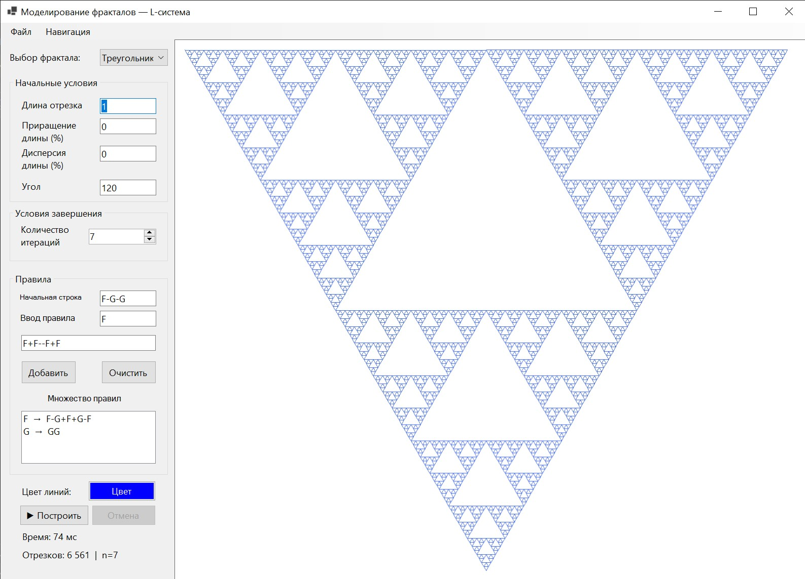
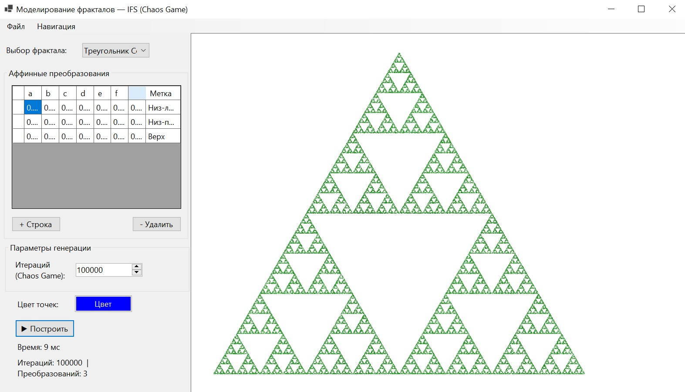
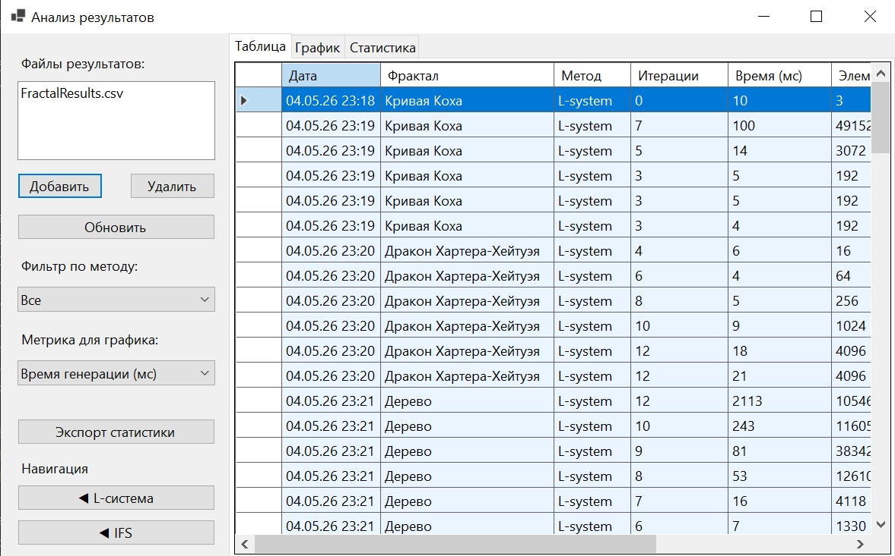

# 🌀 Fractal Modeling

Программный комплекс для генерации, визуализации и сравнительного анализа фрактальных изображений двумя методами: **L-системами** и **системами итерируемых функций (IFS)**.

Разработан в рамках курсовой работы по теме:  
*«Исследование методов порождения фрактальных изображений: сравнительный анализ L-систем и систем итерируемых функций»*

---







---

## 🗂️ Структура проекта

```
FractalModeling/
│
├── LSystem.cs              — логика L-системы (генерация строки, черепашья графика)
├── IFSGenerator.cs         — логика IFS (Chaos Game, LockBits-рендер)
├── FractalPresets.cs       — предустановки фракталов + CSV-логгер результатов
├── LSystemRenderer.cs      — быстрый асинхронный рендерер (Брезенхем + прогресс)
│
├── LSystemForm.cs          — Форма 1: генератор L-систем
├── IFSForm.cs              — Форма 2: генератор IFS
├── AnalysisForm.cs         — Форма 3: анализ и сравнение результатов
│
├── Program.cs              — точка входа
├── FractalModeling.csproj  — файл проекта
│
├── screenshots/            — сюда клади скриншоты для README
└── README.md
```

---

## ⚙️ Требования

| Компонент | Версия |
|---|---|
| OS | Windows 10 / 11 (x64) |
| .NET | 6.0+ (Desktop Runtime) |
| IDE | Visual Studio 2022 (для сборки) |

---

## 🚀 Быстрый старт

### Сборка из исходников

```bash
# 1. Клонируй репозиторий или распакуй архив
# 2. Открой FractalModeling.csproj в Visual Studio 2022
# 3. В файле .csproj убедись, что есть строка:
#    <AllowUnsafeBlocks>true</AllowUnsafeBlocks>
# 4. Нажми F5
```

### Запуск готового .exe

Скачай `.exe` из [Releases](#) и убедись, что установлен  
[.NET 6.0 Desktop Runtime](https://dotnet.microsoft.com/download/dotnet/6.0).

---

## 🖥️ Описание форм

### Форма 1 — L-система


Позволяет генерировать фракталы методом систем Линденмайера.

**Параметры:**

| Поле | Описание | Пример |
|---|---|---|
| Начальная строка (аксиома) | Начальное состояние системы | `F++F++F` |
| Угол (δ) | Угол поворота черепашки в градусах | `60` |
| Длина отрезка | Базовая длина шага черепашки | `1` |
| Приращение (%) | Увеличение шага при каждом F | `0` |
| Дисперсия (%) | Случайное отклонение шага | `0` |
| Количество итераций | Глубина применения правил (1–12) | `5` |

**Правила замены** вводятся по одному: символ → строка-подстановка.  
Примеры правил для кривой Коха: `F → F-F++F-F`

**Предустановленные фракталы:**
- Треугольник Серпинского
- Кривая Коха (снежинка)
- Дракон Хартера–Хейтуэя
- Папоротник Барнсли
- Дерево

> ⚡ **Прогрессивная отрисовка:** фрактал рисуется в реальном времени по мере генерации.  
> Кнопка **⏹ Остановить** прерывает процесс — на экране остаётся то, что успело нарисоваться.

---

### Форма 2 — IFS (Chaos Game)


Генерация фракталов методом систем итерируемых функций.

Каждая строка в таблице — одно аффинное преобразование **f(x,y) = (ax+by+e, cx+dy+f)**:

| Столбец | Описание |
|---|---|
| a, b, c, d | Коэффициенты линейной части (матрица 2×2) |
| e, f | Вектор переноса |
| p | Вероятность выбора преобразования (сумма всех p = 1) |
| Метка | Пояснительное название (стебель, листок и т.п.) |

Строки можно добавлять, удалять и редактировать прямо в таблице.

**Рекомендуемое число итераций:**

| Цель | Итераций |
|---|---|
| Быстрый предпросмотр | 50 000 |
| Стандартное качество | 100 000 – 200 000 |
| Высокое качество | 500 000+ |

---

### Форма 3 — Анализ результатов


Загружает CSV-файлы с результатами генерации и строит сравнительный анализ.

**Вкладки:**

- **Таблица** — все записи с цветовой дифференциацией (синий = L-система, зелёный = IFS)
- **График** — столбчатая диаграмма по выбранной метрике
- **Статистика** — текстовый отчёт: среднее время, сравнение методов по каждому фракталу

**Доступные метрики для графика:**
- Время генерации (мс)
- Количество элементов (отрезков / точек)
- Длина строки L-системы
- Оценка фрактальной размерности D

---

## 💾 Форматы файлов

### Параметры L-системы (`.lsys`)

```
NAME=Кривая Коха
AXIOM=F++F++F
DELTA=60
STEP=1
GROWTH=0
VARIANCE=0
RULE=F|F-F++F-F
```

### Параметры IFS (`.ifs`)

```
NAME=Папоротник Барнсли
T=0.000000|0.000000|0.000000|0.160000|0.000000|0.000000|0.010000|Стебель
T=0.850000|0.040000|-0.040000|0.850000|0.000000|1.600000|0.850000|Листок
T=0.200000|-0.260000|0.230000|0.220000|0.000000|1.600000|0.070000|Лев.побег
T=-0.150000|0.280000|0.260000|0.240000|0.000000|0.440000|0.070000|Прав.побег
```

### Журнал результатов (`.csv`)

```
Timestamp;FractalName;Method;Iterations;ElapsedMs;ElementCount;StringLength;FractalDim;Notes
2025-05-21 14:22:00;Кривая Коха;L-system;5;12;1024;4096;1.261;Delta=60
2025-05-21 14:23:10;Папоротник Барнсли;IFS;200000;163;200000;0;0.0000;Transforms=4
```

Файл создаётся автоматически в папке **Мои документы** (`FractalResults.csv`).  
Открывается в Excel — при импорте указать разделитель `;`.

---

## 🧮 Реализованные алгоритмы

### L-система: генерация строки

```
Сложность: O(k^n)
k = максимальная длина правой части правила
n = число итераций
```

При `k=4` (кривая Коха) и `n=7` строка содержит **≈16 000** символов,  
при `n=10` — **≈1 000 000** символов.

### L-система: черепашья интерпретация

| Символ | Действие |
|---|---|
| `F`, `G`, `A`, `B` | Шаг вперёд + нарисовать отрезок |
| `f` | Шаг вперёд без рисования |
| `+` | Поворот влево на δ° |
| `-` | Поворот вправо на δ° |
| `[` | Сохранить состояние в стек |
| `]` | Восстановить состояние из стека |
| `\|` | Разворот на 180° |
| `X`, `Y`, ... | Нетерминалы — игнорируются |

### IFS: алгоритм Chaos Game

```
Сложность: O(N)
Не зависит от глубины фрактала — только от числа точек N
```

### Оценка фрактальной размерности (box-counting)

Реализован метод «ящиков»: строится зависимость `log N(ε) ~ D · log(1/ε)`,  
наклон прямой определяется методом наименьших квадратов по размерам ε = 4, 8, 16, 32, 64.

### Быстрый рендер (LSystemRenderer)

- **Алгоритм Брезенхема** вместо `Graphics.DrawLine` — прямая запись в пиксели через `LockBits`
- **Фоновый поток** (`Task.Run`) — UI не замерзает
- **Прогрессивная отрисовка** — каждые 2000 отрезков обновляется `PictureBox`
- **Отмена** через `CancellationToken`

---

## 📊 Тестовый набор фракталов

| Фрактал | D (теор.) | L-система | IFS |
|---|---|---|---|
| Треугольник Серпинского | ≈ 1.585 | ✅ 2 правила, δ=120° | ✅ 3 преобразования |
| Кривая Коха (снежинка) | ≈ 1.261 | ✅ 1 правило, δ=60° | ✅ 4 преобразования |
| Дракон Хартера–Хейтуэя | 2.000 | ✅ 2 правила, δ=90° | ✅ 2 преобразования |
| Папоротник Барнсли | ≈ 1.7 | ✅ стохастич., δ=25° | ✅ 4 преобразования |
| Дерево | ≈ 1.5 | ✅ ветвление [ ] | — |

---

## 🔧 Пользовательские фракталы

**Создание через L-систему:**
1. В списке выбери **«Пользовательский»**
2. Введи аксиому, угол и правила вручную
3. Нажми **«▶ Построить»**
4. Сохрани через **«📁 Сохранить параметры»** → файл `.lsys`

**Загрузка:**  
«📂 Загрузить параметры» → выбери `.lsys` файл → параметры подставятся автоматически

Аналогично для IFS через файлы `.ifs`.

---

## 📝 Лицензия

Учебный проект. Свободное использование в образовательных целях.
